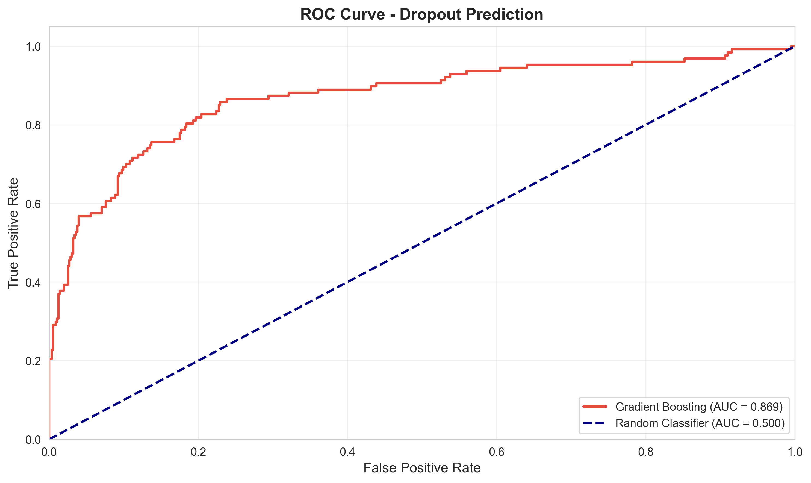
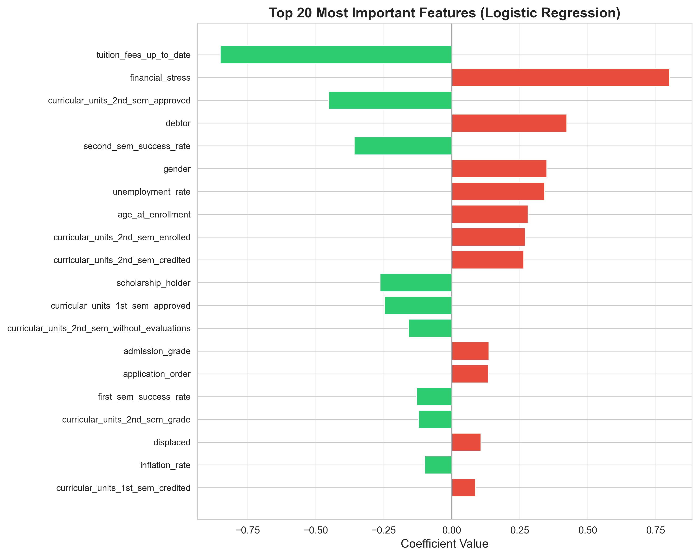
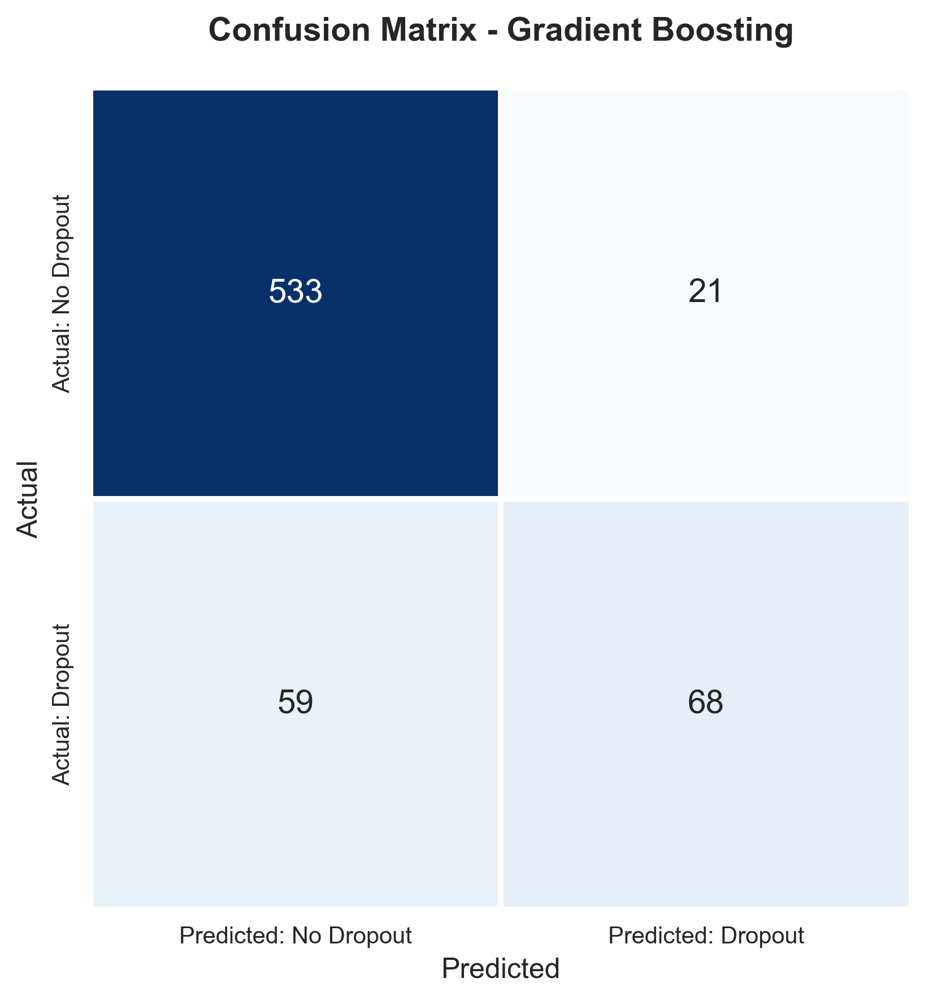
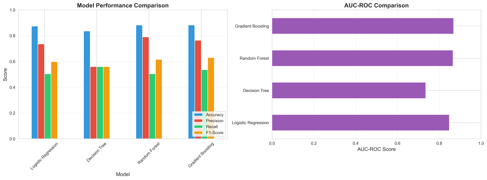

# Student Dropout Prediction: Early Risk Identification System

[](https://www.python.org/)
[](https://scikit-learn.org/)
[](LICENSE)

> A machine learning system to predict student dropout risk and enable early intervention strategies in higher education.

## Table of Contents

- [Overview](#overview)
- [Business Problem](#business-problem)
- [Dataset](#dataset)
- [Methodology](#methodology)
- [Key Findings](#key-findings)
- [Results](#results)
- [Installation](#installation)
- [Usage](#usage)
- [Project Structure](#project-structure)
- [Model Performance](#model-performance)
- [Technologies Used](#technologies-used)
- [Future Work](#future-work)
- [Author](#author)

## Overview

Student dropout is a critical challenge for higher education institutions, impacting both student success and institutional performance. This project develops a **predictive analytics solution** to identify at-risk students early in their academic journey, enabling timely interventions that improve retention rates.

Using machine learning classification models trained on student demographics, academic performance, family background, and macroeconomic factors, the system predicts dropout probability and assigns risk levels to guide institutional support programs.

## Business Problem

### Challenge
- **Student retention** directly affects graduation rates and institutional reputation
- **Late identification** of struggling students limits intervention effectiveness
- **Resource constraints** require targeted support allocation to at-risk populations

### Solution
A data-driven early warning system that:
- Identifies high-risk students at the end of first semester
- Quantifies dropout probability for prioritized intervention
- Reveals key factors influencing student persistence
- Enables proactive rather than reactive student support

### Impact
- **Improved retention rates** through early intervention
- **Optimized resource allocation** to students who need it most
- **Data-driven policy decisions** for institutional programs
- **Enhanced student success outcomes** and graduation metrics

## Dataset

### Overview
- **Size**: 4,424 student records (3,403 after preprocessing and outlier removal)
- **Features**: 37 variables covering demographics, academics, family background, and economics
- **Target**: Student status (Dropout, Graduate, Enrolled)
- **Modeling Target**: Binary classification (Dropout vs. Not Dropout)

### Feature Categories

**Demographics**
- Age at enrollment, gender, marital status, nationality

**Academic Background**
- Admission grade, previous qualifications, course enrollment, attendance type

**Family Background**
- Parental education levels, parental occupations

**Academic Performance**
- Semester grades, units enrolled/approved, success rates (1st and 2nd semester)

**Financial Indicators**
- Scholarship status, debtor status, tuition payment status

**Macroeconomic Context**
- Unemployment rate, inflation rate, GDP growth

**Full Data Dictionary**: See [DATA_DICTIONARY.md](DATA_DICTIONARY.md)

### Class Distribution
- **Dropout**: ~32% (1,421 students)
- **Graduate**: ~50% (2,209 students)
- **Enrolled**: ~18% (794 students)

Binary target (Dropout vs. Not Dropout): **32% / 68%** split

## Methodology

### 1. Data Preprocessing
- **Column standardization**: Cleaned and normalized feature names
- **Target creation**: Binary dropout indicator (1=Dropout, 0=Graduate/Enrolled)
- **Outlier detection**: IQR-based outlier removal (3x IQR threshold)
- **Missing values**: None detected (complete dataset)

### 2. Exploratory Data Analysis
- **Distribution analysis** of numerical and categorical features
- **Correlation analysis** to identify multicollinearity
- **Target relationship analysis** comparing dropout vs. non-dropout groups
- **Visualization suite** including histograms, boxplots, heatmaps, and bar charts

### 3. Feature Engineering
Created derived features to capture complex patterns:
- `first_sem_success_rate`: Ratio of approved to enrolled units (1st semester)
- `second_sem_success_rate`: Ratio of approved to enrolled units (2nd semester)
- `avg_semester_grade`: Mean of 1st and 2nd semester grades
- `max_parental_education`: Higher education level between parents
- `financial_stress`: Combined debtor and tuition overdue indicator

### 4. Model Development
Trained and compared multiple classification algorithms:
- **Logistic Regression** (baseline)
- **Decision Tree**
- **Random Forest**
- **Gradient Boosting**

### 5. Model Evaluation
Comprehensive evaluation metrics:
- **Confusion Matrix** analysis
- **Precision, Recall, F1-Score**
- **ROC-AUC** curve and score
- **Cross-validation** (5-fold stratified)
- **Feature importance** analysis

### 6. Model Deployment
- Saved best-performing model artifacts (`.pkl` format)
- Created prediction pipeline for new students
- Developed risk scoring system (Low/Medium/High)

## Key Findings

### 1. Academic Performance is Critical
- **First semester grades** are the strongest predictor of dropout risk
- Students averaging **<10 (on 0-20 scale)** in first semester show significantly elevated dropout rates
- **Success rate** (approved/enrolled units) is highly predictive

### 2. Financial Factors Matter
- **Scholarship holders** demonstrate **lower dropout rates**
- Students with **financial stress** (debtor or overdue tuition) are at higher risk
- **Economic conditions** at enrollment (unemployment rate) correlate with dropout probability

### 3. Background Influences
- **Parental education** levels impact student persistence
- Students from **first-generation** college backgrounds need additional support
- **Age at enrollment** can be a risk factor (non-traditional students)

### 4. Early Intervention Window
- **First semester performance** provides earliest actionable signal
- Risk assessment at semester end enables timely intervention before second semester
- Combined academic + financial indicators yield strongest predictions

## Results

### Model Performance

| Model | Accuracy | Precision | Recall | F1-Score | AUC-ROC |
|-------|----------|-----------|--------|----------|---------|
| Logistic Regression | 87.4% | 73.6% | 50.4% | 0.598 | 0.849 |
| Decision Tree | 83.6% | 55.9% | 55.9% | 0.559 | 0.736 |
| Random Forest | 88.3% | 79.0% | 50.4% | 0.615 | 0.866 |
| **Gradient Boosting** | **88.3%** | **76.4%** | **53.5%** | **0.630** | **0.869** |

Produced with scikit-learn 1.3.0 on Python 3.11. Tree ensembles shift by a few
tenths of a percent across scikit-learn versions, so your run may differ slightly.

### Best Model: Gradient Boosting
- **AUC-ROC**: 0.869 (strong separation between dropout and non-dropout students)
- **Accuracy**: 88.3% (overall correctness)
- **Precision**: 76.4% (three of every four flagged students do drop out)
- **Recall**: 53.5% (captures just over half of actual dropouts)

Random Forest matches on accuracy but trails on recall and F1, so Gradient
Boosting is selected — catching more at-risk students matters more here than
avoiding false alarms.

### Feature Importance (Top 10)
1. Curricular units 1st semester grade
2. Curricular units 2nd semester grade
3. First semester success rate
4. Admission grade
5. Scholarship holder status
6. Age at enrollment
7. Debtor status
8. Unemployment rate
9. Previous qualification grade
10. Tuition fees up to date

*Full feature importance available in `results/feature_importance.csv`*

## Visualizations

### ROC Curve

How well the model separates dropouts from non-dropouts across every decision
threshold. AUC of 0.869 against 0.500 for a coin flip.



### Feature Importance

Which variables drive the prediction. First and second semester results
dominate, which is what makes end-of-first-semester intervention viable.



### Confusion Matrix

Where the model is right and wrong on the 681-student test set.



### Model Comparison

All four algorithms across accuracy, precision, recall, F1 and AUC-ROC.



Three more — target distribution, correlation heatmap, and feature
distributions by dropout status — are in [`visualizations/`](visualizations/).
All seven regenerate with `python run_analysis.py`.

## Installation

### Prerequisites
- Python 3.8 or higher
- pip package manager

### Setup

1. **Clone the repository**
```bash
git clone https://github.com/Abu-249607/student-dropout-prediction.git
cd student-dropout-prediction
```

2. **Create a virtual environment**

Do this before installing. Installing into a base Anaconda or system Python
will change versions other projects depend on.

```bash
python -m venv venv
source venv/bin/activate  # On Windows: venv\Scripts\activate
```

3. **Install dependencies**
```bash
pip install -r requirements.txt
```

4. **Add your dataset**
- Place `Dropout.xlsx` in the `data/` directory
- See `data/README.md` for data requirements

## Usage

### Option 1: Automated Analysis (Recommended)

Run the complete analysis pipeline with a single command:

```bash
python run_analysis.py
```

This will:
- Load and preprocess the data
- Generate 7 professional visualizations
- Train and compare 4 ML models
- Save the best model and generate reports
- Create comprehensive analysis summary

**Output**: All visualizations saved to `visualizations/`, models to `models/`, and reports to `results/`

### Option 2: Jupyter Notebook (Interactive Exploration)

```bash
jupyter notebook student_dropout_prediction.ipynb
```

Run all cells to:
- Load and explore the dataset
- Perform comprehensive EDA
- Train and evaluate models
- Generate visualizations
- Save model artifacts

### Option 3: Prediction Script

**Interactive mode** (single student):
```bash
python predict.py --interactive
```

**Batch prediction** (CSV file):
```bash
python predict.py --student_file data/new_students.csv --output_file predictions.csv
```

### Option 4: Use Utility Functions

```python
from utils import load_data, engineer_features, evaluate_model
import joblib

# Load data
df = load_data('data/Dropout.xlsx')

# Engineer features
df_engineered = engineer_features(df)

# Load trained model
model = joblib.load('models/dropout_prediction_model.pkl')

# Make predictions
# ... your code here
```

## Project Structure

```
student-dropout-prediction/
│
├── data/
│   ├── README.md                       # Data documentation
│   └── Dropout.xlsx                    # Dataset (add locally, excluded from git)
│
├── models/
│   ├── README.md                       # Model documentation
│   ├── dropout_prediction_model.pkl    # Trained model (generated)
│   ├── feature_scaler.pkl              # Feature scaler (generated)
│   ├── feature_names.pkl               # Feature list (generated)
│   └── scale_features.pkl              # Scaling configuration (generated)
│
├── results/
│   ├── ANALYSIS_REPORT.md              # Analysis summary (generated)
│   ├── analysis_summary.json           # Machine-readable results (generated)
│   ├── model_comparison.csv            # Performance metrics (generated)
│   └── feature_importance.csv          # Feature rankings (generated)
│
├── visualizations/
│   ├── 01_target_distribution.png      # Class balance
│   ├── 02_correlation_heatmap.png      # Feature correlations
│   ├── 03_feature_comparison.png       # Distributions by dropout status
│   ├── 04_confusion_matrix.png         # Test set predictions
│   ├── 05_roc_curve.png                # Model discrimination
│   ├── 06_model_comparison.png         # All four algorithms
│   └── 07_feature_importance.png       # Top 20 predictors
│
├── student_dropout_prediction.ipynb    # Notebook walkthrough
├── run_analysis.py                     # End-to-end analysis pipeline
├── utils.py                            # Shared helper functions
├── predict.py                          # Score new students
├── requirements.txt                    # Python dependencies
├── DATA_DICTIONARY.md                  # Feature documentation
├── README.md                           # This file
├── LICENSE                             # MIT License
└── .gitignore                          # Git ignore rules
```

## Model Performance

### Classification Metrics Explained

- **Accuracy**: Overall correctness (correct predictions / total predictions)
- **Precision**: Of predicted dropouts, how many actually dropped out (reduces false alarms)
- **Recall**: Of actual dropouts, how many we identified (captures at-risk students)
- **F1-Score**: Harmonic mean of precision and recall (balanced metric)
- **AUC-ROC**: Model's ability to distinguish between classes (0.5=random, 1.0=perfect)

### Business Trade-offs

**High Precision** → Fewer false alarms, but may miss some at-risk students
**High Recall** → Catch more dropouts, but more students flagged unnecessarily

This project prioritizes **recall** (catching at-risk students) while maintaining acceptable precision to avoid overwhelming support resources.

## Technologies Used

### Core Libraries
- **pandas** (2.0.3): Data manipulation and analysis
- **numpy** (1.24.3): Numerical computing
- **scikit-learn** (1.3.0): Machine learning models and evaluation

### Visualization
- **matplotlib** (3.7.2): Static plots and charts
- **seaborn** (0.12.2): Statistical visualizations

### Development Tools
- **Jupyter** (1.0.0): Interactive notebook environment
- **openpyxl** (3.1.2): Excel file handling

### Deployment
- **joblib** (1.3.1): Model serialization

## Future Work

### Model Improvements
- [ ] **Hyperparameter tuning** using GridSearchCV or RandomizedSearchCV
- [ ] **SMOTE** or other techniques to handle class imbalance
- [ ] **Ensemble methods** combining multiple models
- [ ] **Deep learning** approaches (neural networks)
- [ ] **SHAP values** for explainable AI and individual predictions

### Feature Engineering
- [ ] **Interaction terms** between key features
- [ ] **Polynomial features** for non-linear relationships
- [ ] **Time-series features** (trend in grades over time)
- [ ] **External data** integration (course difficulty, instructor ratings)

### Deployment
- [ ] **Web application** for easy access by advisors
- [ ] **API endpoint** for integration with student information systems
- [ ] **Automated reporting** and alert system
- [ ] **Real-time scoring** for current students
- [ ] **Dashboard** for institutional monitoring

### Business Applications
- [ ] **A/B testing** intervention effectiveness
- [ ] **Cost-benefit analysis** of retention programs
- [ ] **Longitudinal study** tracking intervention outcomes
- [ ] **Segmentation analysis** for targeted support programs

## References & Resources

- **Dataset Source**: [Specify original source if applicable]
- **Scikit-learn Documentation**: https://scikit-learn.org/
- **Educational Data Mining**: https://educationaldatamining.org/

## Author

**Abhishek Subramani**
Graduate Student | Management Science & Business Analytics
Suffolk University

- Email: abhishek.ssubramani@gmail.com
- LinkedIn: [abhisheksubramani](https://www.linkedin.com/in/abhisheksubramani/)
- GitHub: [@Abu-249607](https://github.com/Abu-249607)

## License

This project is licensed under the MIT License - see the LICENSE file for details.

## Acknowledgments

- Suffolk University for the academic foundation in analytics
- [Data source attribution if applicable]
- Open-source community for the excellent Python libraries

---

**If you found this project helpful, please consider giving it a star!**

**Questions or suggestions? Open an issue or reach out directly.**
